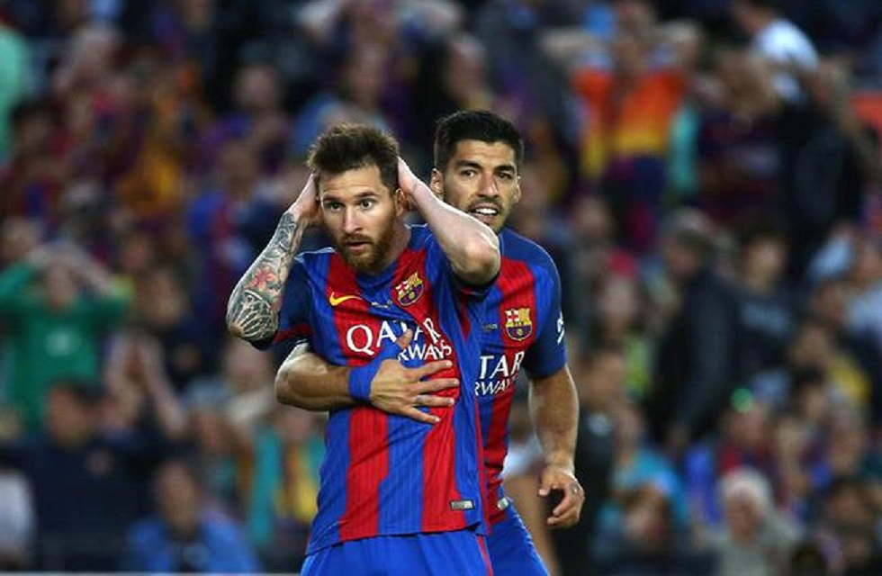

# WEBwork
WEB期末作业

# 开发报告
## 策划思路：

 1. 思路来源：本人喜欢看足球比赛，所以希望做一个快速查看足球简报（包括比赛和新闻）的网站。
 2. 期望效果：可以查看每一场比赛的结果和简单介绍；可以预告一周内比赛的时间；可以及时更新关于足球的新闻。
 3. 网页来源：主要参考新浪体育，文字方面来源于腾讯体育。

----------
## 页面结构：

 - [首页][1]：涵盖所有内容简介的页面，由一个导航栏连接到其他的页面。首页第一部分运用js设置了3张滚动图片，分别对应图片下面的简单的最新赛事介绍。第二部分罗列部分俱乐部图标以及名称。第三部分是足球的时事新闻，包括教练和球员。
 - [列表页][2]：列表页罗列了一轮西甲的比赛结果，可以通过“全场战报”链接到详细页。
 - [详细页][3]：详细页记录了球赛的介绍，精彩瞬间的介绍。旁边固定了一个赛程表，方便查看赛事时间。
 - [表单页][4]：表单页设置为“球迷的调查问卷”，采用匿名的方法收集用户对于足球的喜爱情况和对网站的建议。

----------
## 技术指标：

 - 使用的html/css版本：html、html5、css、css3。
 - 开发工具：主要使用“Google Chrome”浏览器；使用“Subline Text 3”编辑器。
 

----------
## 技术点：

 1. 首页导航栏设计：通过使用栅栏布局设置横向布局，使用css:hover选择器设置鼠标指针浮动在上面的元素改变颜色。
例子：
`#second a :hover{ color: #999; }`
在最后的网页标志上也运用这样的代码。
 2. 首页轮播图设计
 问题：在静态页面上通过js设置图片滚动效果。
 解决方案：通过扒“jQuery之家”的js代码，成功搞出了轮播图的设置。
主要代码：
**html代码**

   ` 
   

  

    <ul class="slider-img-ul">
      <li></li>
      <li></li>
      <li></li>
      <li></li>
      <li></li>
    </ul>
  

 ` 

**css代码**
`
    .slider {
    width: 1200px;
    margin: 50px auto;
    position: relative;
}
.slider:hover .slider-btn {
    color: #fff;
    text-shadow: 0 0 5px #666;
}
.slider .slider-img {
    width: 12000px;
    position: relative;
}
.slider .slider-img .slider-img-ul {
    position: absolute;
    left: 0;
    top: 0;
    overflow: hidden;
}
.slider .slider-img .slider-img-ul li {
    float: left;
}
.slider .slider-img .slider-img-ul li img {
    width: 1200px;
    height: 460px;
}
.slider .slider-dot ul {
    position: absolute;
    right: 50px;
    bottom: 30px;
}
.slider .slider-dot ul li {
    cursor: pointer;
    width: 10px;
    height: 10px;
    border-radius: 50%;
    background: #ccc;
    border: 2px solid #fff;
    float: left;
    margin-left: 10px;
}
.slider .slider-dot ul li.active, .slider .slider-dot ul li:hover {
    background: #fff;
}
.slider .slider-btn {
    position: absolute;
    width: 50px;
    height: 100px;
    top: 50%;
    line-height: 100px;
    text-align: center;
    color: #fff;
    font-size: 28px;
    text-decoration: none;
    font-family: '黑体';
    color: rgba(255, 255, 255, 0);
}
.slider .slider-btn:hover {
    background: rgba(125, 125, 125, .3);
}
.slider .slider-btn.slider-btn-left {
    left: 0;
    margin-top: -50px;
}
.slider .slider-btn.slider-btn-right {
    right: 0;
    margin-top: -50px;
}   `
**敲代码的时候一定不能忘了引入jquery和xSlider.js文件**

 3. 插入视频：运用HTML5可以插入视频。使用`embed`标记使用外部链接，可以链接优酷等视频网站。
 **例如：**
` 

		<embed src="http://video.sina.com.cn/share/video/251070522.swf" 
    controls=playbutton width="100%" type="application/x-shockwave-flash"></embed>
	
 `

 

----------
## 开发心得：
开发过程遇到的问题并不算多，因为这个网站做的十分简单。这次布局方面运用了大量的栅栏布局，也确实简单方便实用。这门课程要求极强的操作能力，平时也需要多搞搞电脑。我这方面的能力也比较弱，需要多加强。平时我应该多看看网上优秀的网页，学习网页的布局和搭配。我希望能学习的更深入，学习javascripe使得网页可以更加多元化。

  [1]: index.html
  [2]: list.html
  [3]: minute.html
  [4]: form.html
